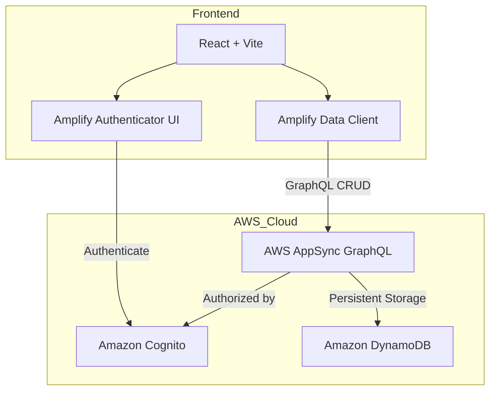

# To-Dooo — Premium Task Management with AWS Amplify Gen 2

To-Dooo is a premium, high-performance task management application built with **React + Vite** and powered by a fully serverless backend using **AWS Amplify Gen 2**. It features a modern dark-themed UI with glassmorphism, focus animations, and a secure, per-user isolated data architecture.

---

## 🚀 Key Features

- **🔐 Secure Authentication**: Full sign-up and sign-in flow powered by **Amazon Cognito**.
- **☁️ Serverless Data**: Real-time task management using **AWS AppSync (GraphQL)** and **Amazon DynamoDB**.
- **🔒 User Data Isolation**: Uses **Owner-based Authorization** — each user can only see and manage their own tasks.
- **🔴🟡🟢 Priority & Categories**: Organize tasks with priority levels and custom categories (Work, Personal, etc.).
- **📊 Live Dashboard**: Real-time stats for total, active, and completed tasks.
- **✨ Premium UI**: Dark mode design with smooth animations, search, and responsive layouts.

---

## 🏗️ Architecture

---

## 📂 Project Structure (Amplify Gen 2)

The application uses the brand-new **AWS Amplify Gen 2** code-first approach:

- **`amplify/auth/resource.ts`**: Defines the Amazon Cognito configuration (Email sign-in).
- **`amplify/data/resource.ts`**: Defines the data schema (Todo model) and owner-based authorization rules.
- **`amplify/backend.ts`**: The root backend file that bundles auth and data together.
- **`src/api.js`**: A simplified API layer that uses the Amplify auto-generated typed client to talk to AWS.
- **`src/App.jsx`**: Uses the `<Authenticator>` component to protect the app with a login screen.

---

## 🛠️ How it Works (Technical Summary)

1.  **Authorization**: We use `.authorization((allow) => [allow.owner()])` in the data model. This automatically tags every Todo with an `owner` ID and ensures that only the creator can read/write that specific record.
2.  **Infrastructure as Code**: The entire backend is defined in TypeScript. When deployed, Amplify uses the **AWS CDK** to provision exactly what is needed.
3.  **Frontend Integration**: The frontend connects to AWS using an auto-generated `amplify_outputs.json` file. The SDK handles JWT token management and API request signing automatically.

---

## 📦 Deployment

This app is designed to be hosted on **AWS Amplify Hosting**.

1.  **Push to GitHub**: Connect your local repository to a new GitHub repository.
2.  **Connect to Amplify**: Go to the AWS Amplify Console and connect your branch.
3.  **Build Settings**: Amplify will automatically detect the Gen 2 backend and run the necessary `ampx` commands to deploy your infrastructure and frontend in one step.

---

## 💻 Tech Stack

- **Framework**: React 19 + Vite 8
- **Backend**: AWS Amplify Gen 2 (Serverless)
- **Auth**: Amazon Cognito
- **API**: AWS AppSync (GraphQL)
- **Database**: Amazon DynamoDB
- **Styling**: Vanilla CSS (Custom Premium Design System)

---

Developed as a demonstration of **AWS Serverless Architecture** and **Modern Frontend Design**.
